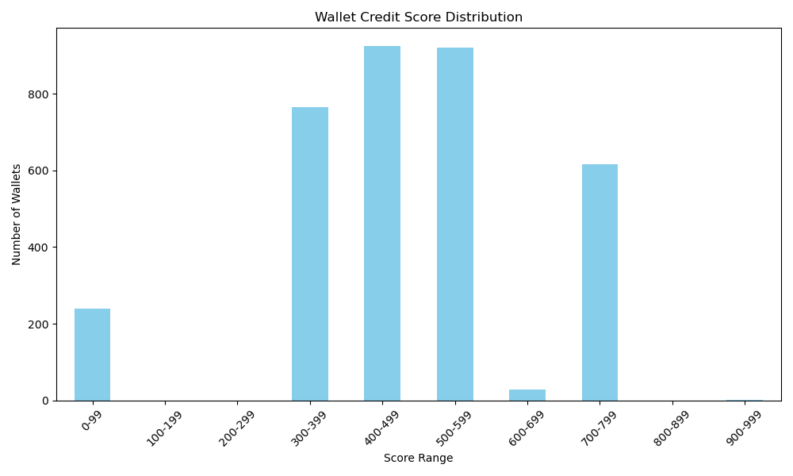

# 🧠 Wallet Credit Score Analysis

### 📊 Score Distribution


### 🔍 Behavior of Low-Scoring Wallets (0–300)
- Tend to have **low deposit amounts**, **high borrow-to-deposit ratios**, **few transactions**, and **short activity duration**.
- Statistical summary:

```
       credit_score
count    239.000000
mean      24.150628
std       21.499714
min       10.000000
25%       10.000000
50%       10.000000
75%       60.000000
max       63.000000
```

### 💰 Behavior of High-Scoring Wallets (700–1000)
- Typically show **high deposits**, **low borrowing**, **high transaction counts**, and **longer active periods**.
- Statistical summary:

```
       credit_score
count    619.000000
mean     786.568659
std       14.608584
min      766.000000
25%      790.000000
50%      790.000000
75%      790.000000
max     1000.000000
```
